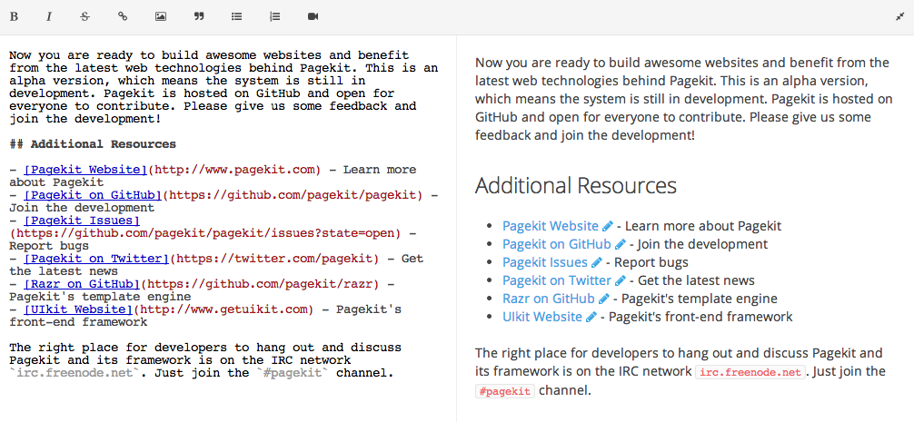

# Markdown 编辑器

现在向你介绍很多地方都能看到的主要的编辑器工具：Pagekit Markdown 编辑器。

Let's introduce you to the the main editing tool you will see in all places: Pagekit's powerful markdown editor.

要编辑内容，你可以使用带自动完成功能的代码助手书写HTML代码或者使用标准的[Markdown语法](http://daringfireball.net/projects/markdown/syntax)。你也可以在Markdown中添加HTML代码片段。当你在左侧书写了内容，你将会在右侧看到实时预览和最终输出结果。要设置这个功能，你可以在编辑器上方的设置中启用或关闭这项功能。编辑器工具栏支持通用Markdown元素且允许你选择文本样式，插入链接，引用和媒体元素。

To edit content, you can write HTML with some autocompletion aid or use the popular [markdown syntax](http://daringfireball.net/projects/markdown/syntax). You can even include HTML snippets in markdown. As you create your content on the left, you will see a real-time preview of the final output on the right. To define how the content is rendered, you can enable or disable markdown in the settings above the editor. The editor's toolbar supports you with common markdown elements and allows you to choose text styles, insert links, quotes, lists and media elements.

## 插入图像

要插入图像，只需要点击图像图标，同时右侧的图像占位符将会显示这一操作的预览。鼠标停留在占位符上并点击*设置*按钮。弹出的对话框中选择*选择图像*，你可以将本地或网络图片拖动到指定位置并放开鼠标以完成上传。

To insert an image, just click the image icon and a placeholder area will appear in the content preview. Hover over the placeholder and click on the *Settings* button. A modal will appear where you can choose a picture or drag and drop the desired image file from your local file browser.

### 一：设置空白图像

### 二：选择图像文件

### 三：更新已选图像的设置

**注意** 添加视频或非正式文件所做的工作几乎一样，添加完成后你可以随时打开*设置*对话框。

**Note** Adding videos or other binary files works just the same - and when you've inserted your files you can always go to the *Settings* dialog again.

## 插入链接

在链接的右侧会存在一个小铅笔，你可以点击它来调出设置面板，来选择指向的目标位置或手动输入一个URL地址。

Links have a little pencil icon that you can click to call up the settings panel - either select the link's destination or manually enter a URL.

