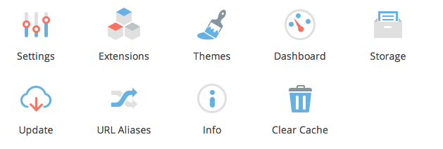

# 设置

点击*设置*在主导航看到在一个地方所有重要的设置 - 拆分成*系统设置*和*其他设定*。

## 系统

### 网站

填写你的网站主要信息，请设置您的FrontPage并启用维护模式。

### 邮件

为您的网站的电子邮件通信进行设定。 Pagekit使用* PHP的邮件*默认情况下，但你也可以启用* SMTP邮件*，然后输入您的凭据。

### 本地化

设置网站，管理区的语言和语言环境设置的站点应使用来显示的日期。

### 系统

为了使Pagekit与市场（自动下载和扩展的更新）自动通信，你需要一个*API密钥*。登录到[www.pagekit.com]（HTTP://www.pagekit.com）来生成API密钥。 

要确定您希望收到的那种更新，选择*释放通道*。在生产环境中，您通常选择*稳定*收到更新通知仅适用于稳定的版本。开发人员都希望选择*每晚*所有版本，包括开发版本。 

*存储*定义上传文件夹的媒体文件。 

设置*缓存模式*（*自动*将选择最合理的方式）。 

开发人员可以启用调试模式（详情显示例外 - 在生产环境中禁用此），一个调试工具栏（在屏幕的底部显示），或选择禁用缓存。

## 插件 & 主题设置

使用这些面板，您可以管理您的扩展和主题。 
这表明你挂起的更新，并允许您上传新的扩展。 DonЎЇt忘记启用新的扩展你已经安装了这些以后。 

当你输入了一个API密钥在*系统设置*，您还可以访问*市场*在这个领域搜索并安装扩展和主题。

## 仪表盘

使用此部分可以添加，删除和排列的小部件上的仪表板。仪表盘是你登录到管理区，可以通过在主菜单点击Pagekit标志进行访问后，看到主屏幕。

## 储存

在*存储*区为您提供了一个概述在你上传的文件。使用简单的文件管理器，您可以管理您的媒体并上传新文件。简单地拖放从本地文件浏览器，或单击*上传*按钮。
## 升级

在本节中，您可以在有一个新的版本单击更新Pagekit。

## 伪静态

Pagekit允许您更改网址别名，你想要的任何东西。

## 系统信息

在这里你可以找到你的服务器的详细信息，需要通过Pagekit文件权限的概述。请参阅本节中，如果你遇到麻烦，需要提供您的服务器环境细节的人给你支持。

## 清除缓存

清除Pagekit系统缓存以及模板缓存和临时文件。