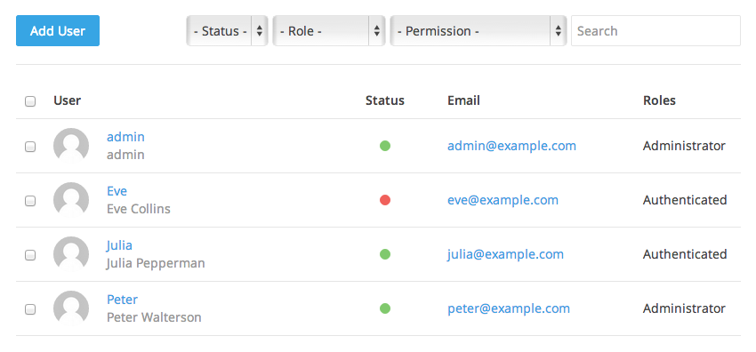

#用户

创建和管理用户，用户角色和访问级别，以控制接入用户有多少你的网站。

##用户

在*用户*选项卡上，您可以添加，激活，阻止或删除某些用户。

用户的配置文件包含一个*用户名*（用于登录，仅限于字母数字字符，数字，点和下划线），一个*姓名*（用于显示整个网站的用户）和*电子邮件*。

这取决于特定的电子邮件地址的用户的个人资料图片显示为[Gravatar]（https://gravatar.com/）。

##权限

在*权限*标签上，您可以看到用户角色，他们被允许执行的操作的概述。

该权限由他们根据分机分组，可以通过切换复选框被分配或撤销。更改会自动保存。

**注意**你必须给*访问管理区*许可，谁应该在后端执行任何操作的所有角色，哪怕是有限的编辑页面。否则他们将无法到达的页面“管理区域。

##角色

在*角色*选项卡中，您可以创建和管理用户角色，用户组织到组具有相同权限和访问级别的一种方式。

Pagekit带有一些预先定义的角色，你也可以添加新的，如果默认值是不够的，你的用例。默认的角色是：

|用户/组|说明|
|------------------|------------------------------ ---------------------|
|匿名|任何随机访问者到你的网站。 |
|已验证|与谁已登录的帐户的用户|
|管理员|与特权来执行所有操作的用户。 |

##访问级别

在*访问级别*选项卡中，你可以配置你的网站的某些部分的可见性。

这背后的想法是对您的内容（或菜单项等）设置访问级别，并分配用户角色，以一定的访问级别。想访问级别为你已经创建了“学生”和“老师”。这样，你可以指定内容到这些组中，即使用户角色变化（新的学生等）。

默认情况下，您可以指定公众，登记或特殊访问级别到您的网站的不同部分（菜单项，网页等）。如果默认的是不够的，你可以创建和配置您自己的访问级别。