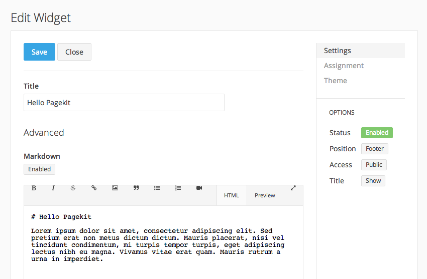
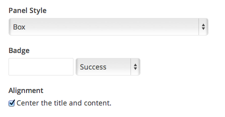

## 小工具 

Widget是一种方式来呈现内容的小块由您所使用的主题定义的区域。 Widget的内容可以是静态的（如一些自定义的HTML，徽标或版权信息）或动态（如您已安装扩展的一个生成幻灯片）。 

在*小工具*概述你看到部件排序它们将被公布。请注意，只有位置显示有出版至少有一个网页上的插件的位置 - 你的主题可能会提供更多的职位比你能看到。

使用拖放来移动一个条目到另一个位置或改变其中有几个部件的位置，里面的渲染顺序。切换之间启用并点击*状态*列中的红色或绿色的圆圈发布状态。 

Pagekit自带的预定义的窗口小部件类型*登录*，*菜单*和*文本*，扩展可以添加更多的小部件类型到此列表中。 

当编辑窗口小部件，您将有*设置*默认选中选项卡。其含量取决于该插件的类型。对于一个文本组件，您将有一个内容编辑区，一个菜单窗口小部件选项来选择菜单等等。 
每一个部件类型有右侧，您可以启用或禁用窗口小部件，并将其分配给你的主题小部件位置提供一组选项。

在*转让*选项卡允许您选择哪个页面的部件将被渲染上。另外，您可以使用简单的模式匹配的URL，你要显示的窗口小部件。您可以将每行一个模式。使用“\*”字符作为通配符，且不页前面加一个感叹号的路径。例如路径：``博客的博客页面，`博客/*`为博客条目或``博客如果要排除的博客。

在*主题*选项卡包括窗口小部件的外观配置设置。你可以选择一个面板风格（像周围widget的内容一箱），增加一个徽章和中心widget的内容。请注意，这些设置是特定于您激活主题。

